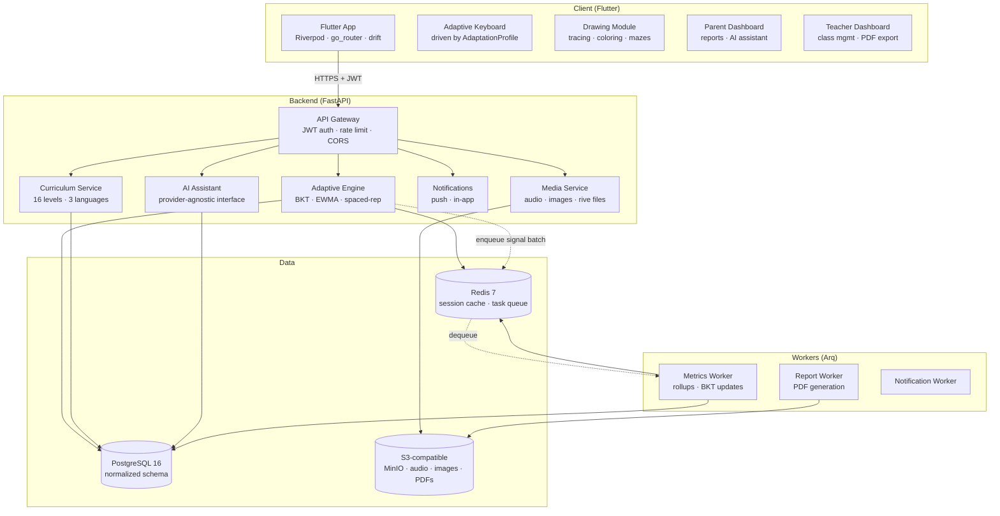

# FlexiKeys — System Architecture

## Overview

FlexiKeys is an adaptive EdTech platform. The **adaptive engine** is the core; all other components exist to feed it signals and surface its outputs.

## System Diagram



## Key Data Flows

### 1 — Child interaction → adaptation update

```
Child taps key
  → Flutter emits KeystrokeEvent (key, latency, offset, accidental_flag)
  → Queued locally in drift (offline-first)
  → Batch-synced to POST /sessions/{id}/events
  → Metrics Worker computes EWMA accuracy, BKT mastery update
  → AdaptationProfile written to DB + pushed to device
  → Flutter rebuilds AdaptiveKeyboard with new profile
```

### 2 — Parent views report

```
Parent opens dashboard
  → GET /parent/children/{id}/report?period=week
  → Backend aggregates progress + adaptation_changes
  → AI assistant summarises in plain language (3 languages)
  → Parent sees: mastery chart, what changed and why, recommendations
```

### 3 — Offline play

```
No network
  → drift local DB serves lessons from last sync
  → Events queued in drift outbox
  → AdaptationProfile frozen at last known state
  → On reconnect: outbox flushed, full sync, profile updated
```

## Module Responsibilities

| Module | Owns |
|---|---|
| `auth` | JWT issue/refresh, OAuth (Google/Apple), argon2id passwords, consent |
| `users` | Parent/teacher/admin accounts, preferences |
| `children` | Child profiles, per-child settings, avatar |
| `curriculum` | Lesson content, level definitions, localized strings/media |
| `sessions` | Session lifecycle, event ingest (idempotent), raw event store |
| `adaptive` | Signal processing, BKT, EWMA, AdaptationProfile CRUD, audit log |
| `progress` | Mastery summaries, streaks, completion records |
| `rewards` | Stars, badges, unlocks — earned only through play |
| `parent` | Parent-facing reports, AI assistant, adaptive-changes feed |
| `teacher` | Class/student management, assignments, class stats, PDF export |
| `admin` | Platform-level management, feature flags, content publishing |
| `ai_assistant` | Provider-agnostic LLM interface, conversation history |
| `notifications` | Push tokens, in-app notification store, worker trigger |
| `media` | Pre-signed URL generation, upload/download, transcoding jobs |

## Security Posture

- JWT access tokens: 15-minute lifetime. Refresh tokens: 30-day, rotated on use, stored hashed.
- Child PII: minimal — display name, avatar choice, birthdate (year only). No real name required.
- Telemetry: pseudonymized at ingest (child_id is a UUID, never linked to PII in analytics).
- No third-party analytics SDKs in the child experience path.
- All endpoints rate-limited. Auth endpoints: stricter limits + account lockout.
- COPPA/GDPR-K: parental consent recorded with timestamp + IP; child data exportable and deletable.